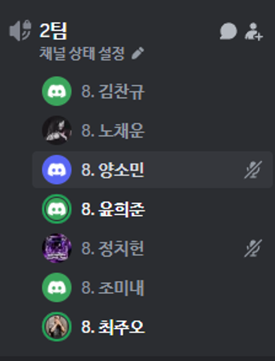
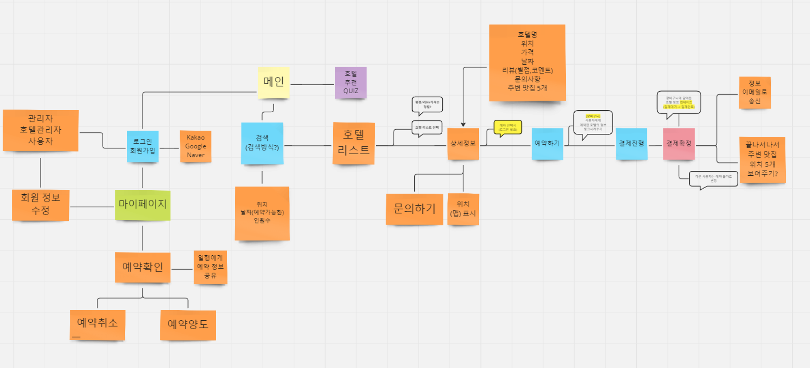
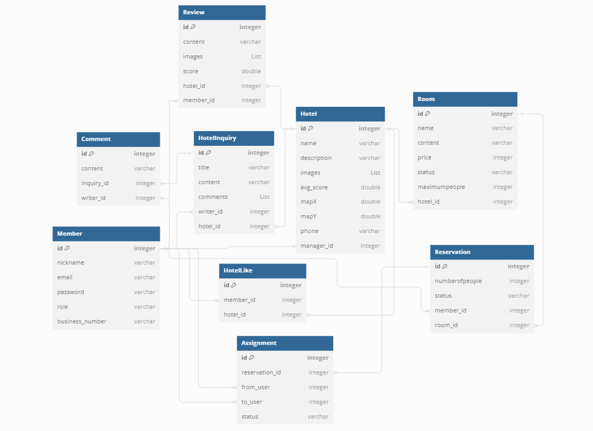

# [1주차] Project_2팀 진행상황 공유

---

프로젝트 팀 구성원을 기재해 주시고, 그 주의 팀원이 어떤 역할을 맡아서 개발을 진행했는지 구체적으로 작성해 주세요. 🙂

---

- 김찬규: 인증 및 회원 기능 개발
- 윤희준: 호텔예약프로그램 메인로직 개발
- 노채운: 결제 시스템 개발
- 최주오 : 숙소 CRUD, 숙소 API
- 조미내: 인증 및 회원기능 개발, 리뷰기능 개발
- 양소민: Q&A 기능 개발
- 정치헌 : 웹사이트 양식 탐색

## 팀 내부 회의 진행 회차 및 일자

---

예) 1회차(2024.03.18) 구글 밋 진행, (OOO님 불참)

- 일주일 간 진행한 내부 회의 횟수와 일자, 진행 방법, 불참 인원을 위와 같이 작성해 주세요.
- 1회차(2024.04.11) 디스코드 회의 진행
- 2회차(2024.04.12) 디스코드 회의 진행
- 3회차(2024.04.13) 디스코드 회의 진행

## 현재까지 개발 과정 요약 (최소 500자 이상)

---

현재까지 진행하고 있는 개발 현황을 기능별 목표, 목표달성률, 성과자체평가(상세히) 작성해주세요.

- 성과자체평가는 ‘기술적으로 새로 알게된 점, 어려웠던 점, 아쉬운 점, 시도해볼 점' 등을 작성해 주시면 됩니다 🙂
- 팀원 각자 현재 구현하고 있는 것을 적어주세요. :)
- ex) 기능별 목표: 암기장 삭제하기 기능 추가 / 목표달성률: 50% - 마켓에서 등록해제는 가능, 내 암기장 삭제는 아직 미구현 / 지속적으로 수정사항이 발생하여 완성도를 올리는 중, 현재 관련 문서 참고 중
- 김찬규
    - 기능별 목표: WebSecurityConfig 세팅 및 JWT 기능 추가, 멤버 관련 기능 개발
    - 목표 달성률: 10%
    - 아직 기획 단계로 프로젝트 초기 세팅과 아이디어톤을 위한 발표 자료를 만드는 단계로 실질적인 개발 진척은 없음
- 조미내
    - 기능별 목표: 인증 및 회원기능 구현, 리뷰작성 기능 구현
    - 목표 달성률: 10% - DB 연결확인, 테이블 구조 짜기
    - 기획 초기 단계, 이번주 부터 본격적인 개발 진행 예정.
- 최주오
    - 기능별 목표 : 한국관광공사 API를 활용하여 숙소 정보 불러오기
    - 목표 달성률 : 5%
    - 1주차에 프로젝트 기획을 진행하고 역할 분담을 하며 프로젝트의 실질적인 개발은 시작하지 않음. API 활용을 위한 방법을 서칭중이며 최신 기술인 RestClient를 활용할 예정
- 윤희준
    - 호텔 메인로직 작성
    - 이제 기획이 완성됬기때문에 어떻게 짤지 전체적으로 고민중.
- 노채운
    - 기능별 목표: Toss 간편결제 시스템 개발
    - 목표 달성률 : 10%
    - 결제 전,후 처리는 후순위로 미루고, 실제 결제에 제공되는 기능은 무엇이 있으며
      어떤 데이터를 필요로 하는지, 필수와 필수가 아닌 것 등등 Docs파악중에 있음
    - 흐름도 이해 후, 결제 성공, 결제 실패, 결제 취소에 대한 로직을 어떻게 구현할 지 고민 예정입니다.
- 양소민
    - 기능별 목표: Q&A 게시판 개발
    - 목표 달성률: 10%
    - 기획 초기 단계, 기초 설정된 프로젝트를 clone 받아서 db 연결 후 entity 만들고 테이블 생성되는 것 까지 확인.
- 정치헌
    - 프론트 강의 복습 등 필요한 부분을 습득
    - 여러가지 웹 양식을 보면서 어떻게 해야할지 고민중

## 개발 과정에서 나왔던 질문 (최소 200자 이상)

---

개발을 진행하며 나왔던 질문 중 핵심적인 것을 요약하여 작성해 주세요 🙂

- application.yaml의 DB 패스워드등 암호를 어떻게 관리할 것인지?
    - 인텔리제이 설정에서 환경 변수로 등록해서 사용하면 application.yaml에서 ${환경변수명} 과 같이 사용 가능함
- MySQL 워크벤치에서 로컬 DB와 연결이 안됨
    - MySQL을 설치할 때, MySQL 서버도 설치해야 로컬 DB를 사용가능 함

## 개발 결과물 공유

---

Github Repository URL: https://github.com/likelion-2thProj-2team/hotelreservation

- 필수) 팀원들과 함께 찍은 인증샷(온라인 만남시 스크린 캡쳐)도 함께 업로드 해주세요 🙂
- 
- 
- 
